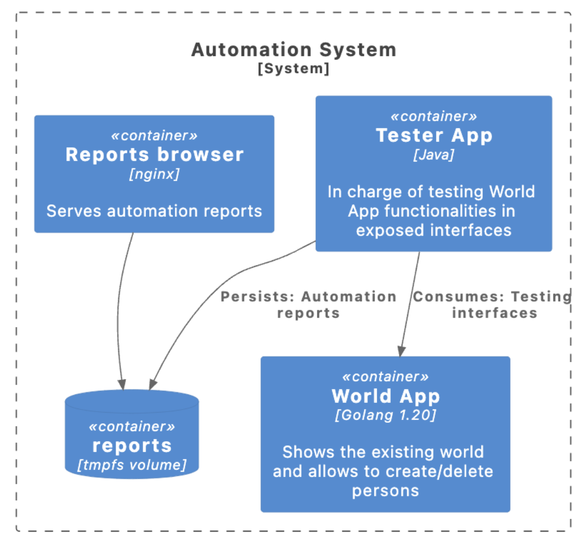

# Automation Challenge

To gauge your proficiency for this position (Software Developer Engineer in Test), we request your participation in a self-administered exercise. This exercise encompasses various levels of increasing difficulty and serves as a means to assess your knowledge. The objective is for you to successfully navigate through all the levels, showcasing your ability to conquer each challenge. Your completion of this exercise will significantly contribute to our evaluation of your skills, and your adeptness at traversing these levels will be a testament to your capabilities.


## Context

**What does the exercise consist of?**

This repository contains an application that has already been developed and now requires testing to ensure it meets all quality criteria for production readiness.
The purpose of this application is to facilitate the registration of people and their geographic location within countries. It features a form for inputting a person details and a display page that showcases all available countries, along with the respective native individuals.


### Business Rules

This application has a set of business rules to ensure an effective user experience.

**Person Creation:** This application, allows to create a person, with essential information such as first name, last name, age, and their corresponding country of residence. Notably, only individuals who have reached the legal age of 18 years can be registered. Also, the fields for name, last name, age, and country are mandatory, guaranteeing the completeness of the provided information.


**Exploring the world:** Users can access a visual representation of all the existing countries, which can be collapsed for clarity. Within each country, a comprehensive listing of residents who belong to that specific nation is displayed. This feature offers a dynamic perspective on the distribution of individuals across different countries.

#
## API

### Views
```
http://localhost:8085/world -> Here you should be able to see what countries exists and the people that belong there.

http://localhost:8085/persons -> Here you can create a person
```

### BFF Endpoints
```
Method: GET 
URL: http://localhost:8085/ping
Description: This endpoint allows you to know that your app is running OK. 
Response: 200 OK with payload {"message":"pong"}
```

```
Method: GET 
URL: http://localhost:8085/bff/persons
Description: This endpoint allows you to get all existing people in the database.
Response: 200 OK with payload [{"id":1,"first_name":"Lionel Andres","last_name":"Messi","age":36,"country_id":1},{"id":2,"first_name":"Ronaldo ","last_name":"de Assis Moreira","age":43,"country_id":2},{"id":3,"first_name":"Luis Alberto","last_name":"Suárez Díaz","age":36,"country_id":3},{"id":4,"first_name":"James David","last_name":"Rodríguez Rubio","age":32,"country_id":4}]
```

```
Method: GET 
URL: http://localhost:8085/bff/countries
Description: This endpoint allows you to get all existing countries in the database.
Response: 200 OK with payload [{"id":1,"name":"Argentina"},{"id":2,"name":"Brazil"},{"id":3,"name":"Colombia"},{"id":4,"name":"Uruguay"}]
```

```
Method: POST 
URL: http://localhost:8085/bff/persons
Description: This endpoint allows you to create a person.
Payload: {"first_name":"Lionel Andres","last_name":"Messi","age":36,"country_id":1}
Response: 201 Created with payload {"id":5,"first_name":"Lionel Andres","last_name":"Messi","age":36,"country_id":1}

```

```
Method: DELETE 
URL: http://localhost:8085/bff/persons/:id
Description: This endpoint allows you to delete a person.
Response: 204 No Content with payload {"message": "Person deleted successfully"}

```

#
## Requirements:
This exercise consists of multiple levels with varying degrees of difficulty, and it is required that you create a repository composed of Java and utilize [Cucumber](https://cucumber.io), [Serenity](https://serenity-bdd.info/), and [ScreenPlay](https://serenity-bdd.github.io/docs/screenplay/screenplay_fundamentals) for conducting automated tests on web interfaces and REST APIs.

In a new repository, the automation code and .features files written in [Gherkin](https://cucumber.io/docs/gherkin/) (using BDD approach) for the business test cases must be included. The objective is to validate the functionality of different use cases within this repository. Please note, not all functionalities are correctly implemented; it is in the automation process that identification of correctly functioning features is carried out.

#

 #### **Level 1:** *Use cases .features* 

Compose Gherkin scenarios for the various use cases within this application. If you believe there is any other business rule that is not covered, please feel free to add it.
 
###
#### **Level 2:** *Automate BFF endpoints*

Automate the use cases exposed by REST in the BFF.

###
#### **Level 3:** *Automate create person web page*

Be able to automate all the relevant tests for the person creation form.


###
#### **Level 4:** *Automate world web page*

Validate, through automation, that the ‘world exploration’ view correctly renders the data (countries and persons) and the possible actions that a user can perform.


###
#### **Level 5:** *Save and serve automation report*

We require you to package the application to be tested along with your automation code using Docker and adding to the compose file. Also, Serenity generates [reports](https://serenity-bdd.github.io/docs/reporting/the_serenity_reports) detailing the execution of use cases, and those should be saved in a ephemeral volume in your repository, which will be served by Nginx.
The deliverable would be a package that should set up the entire system, run automated tests on it, and save the execution report. In summary, the Docker Compose should run all tests and provide the ready-to-access report of its execution.

Here is an architecture diagram in [C4 Model](https://c4model.com) standard with a preview of how this should look:



#
## How to start this application?
We suggest to install [Docker](https://docs.docker.com/engine/install/)/[Colima](https://github.com/abiosoft/colima) for container virtualization and the usage of docker compose command.

To instantiate the application, follow these steps:

1. Clone this repository containing the application.
2. Navigate to the directory of the cloned repository.
3. Execute the "docker compose up" command.
4. Once completed, the application will be up and running on port 8085, while Nginx will be accessible on port 8080.

By following these steps, you will successfully have the application deployed and operational.


## Questions

- [gabriel.bertolo@mercadolibre.com](mailto:gabriel.bertolo@mercadolibre.com)
- [eric.parisi@mercadolibre.com](mailto:eric.parisi@mercadolibre.com)